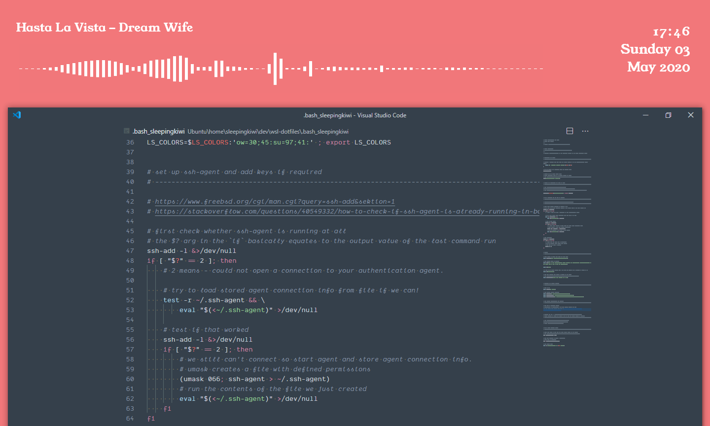

# ⚫files for my wsl setup



## ❗ before using these files

_several files in this directory expect WSL to mount drives at the root: `/c` instead of `/mnt/c`._

__It won't work correctly if you are using the default of `/mnt/{drivename}`__

### making WSL mount to `/`

- in WSL bash:
- `$ sudo nano /etc/wsl.conf`
- add the following to that file and write it out:

```shell
[automount]
root = /
options = "metadata"`
```

_the `options = "metadata"` part is not required but is worthwhile! read more [here](https://blogs.msdn.microsoft.com/commandline/2018/01/12/chmod-chown-wsl-improvements/)_

## installing linux dotfiles

- in WSL bash:
- `$ git clone https://github.com/sleepingkiwi/wsl-dotfiles.git ~/.dotfiles`
- `$ bash ~/.dotfiles/_install.sh`
- `$ cd ~/`
- `$ nano .bashrc`
- paste contents from `.bashrc` in this repo at the bottom of existing file.

## updating dotfiles

- `$ cd ~/.dotfiles`
- `$ git pull`
- `$ bash ~/.dotfiles/_install.sh`

---

## what is

### `.nanorc`

adding syntax highlighting to make quick edits easier

### `.bashrc and .bash_sleepingkiwi`

customising bash, adding aliases, defining colours etc.

all custom stuff is kept in .bash_sleepingkiwi and just imported into .bashrc because tons of other programs want to be editing .bashrc all the time and it gets noisy in there.

### `.inputrc`

customisations to _READLINE_, autocomplete settings mainly.

### `base16.yml`

scheme file for custom [base 16](http://chriskempson.com/projects/base16/) colour scheme.

### `windows-terminal`

settings, theme and colours for windows terminal

### `ConEmu.xml`

settings, theme and colours for conemu terminal emulator

#### installing

- easiest option might be just copying file contents over to the settings file at `/mnt/c/Users/`__joe__`/AppData/Roaming/ConEmu.xml`
- symlinking might be risky because ConEmu expects to be able to write back to this file.

### `./rainmeter`

layout and skins for rainmeter

#### installing rainmeter skins

- install [rainmeter](https://www.rainmeter.net/)
- these will overwrite existing files:
- `$ cp -rf ~/.dotfiles/rainmeter/skins/sleepingkiwi/ "/mnt/c/Users/`__joe__`/Documents/Rainmeter/Skins/"`
- `$ cp -rf ~/.dotfiles/rainmeter/layout/sleepingkiwi/ "/mnt/c/Users/`__joe__`/AppData/Roaming/Rainmeter/Layouts/"`
- `$ cp -rf ~/.dotfiles/rainmeter/layout/sleepingkiwi-vertical/ "/mnt/c/Users/`__joe__`/AppData/Roaming/Rainmeter/Layouts/"`
- install [Fountain of Colors](https://github.com/alatsombath/Fountain-of-Colors/releases) for live spectrum analysis
- configure it's settings (C:\Users\joe\Documents\Rainmeter\Skins\Fountain of Colors\@Resources\Variables.inc) using the [rainmeter/fountain-variables.inc](./rainmeter/fountain-variables.inc) file in this repo
- activate the `sleepingkiwi-vertical` layout from rainmeter settings to put everything on second vertical monitor (as per screenshot)

### `./sleepingkiwi-vscode`

colour theme and syntax highlighting for vs code using sleepingkiwi base16 colours

#### installing vs code theme

- install [vs code](https://code.visualstudio.com/)
- this will overwrite existing files:
- `$ cp -rf ~/.dotfiles/sleepingkiwi-vscode/ "/mnt/c/Users/`__joe__`/.vscode/extensions/"`
- activate the theme from vs code settings

### `./firefox-theme.txt`

load the URL to setup your firefox colour theme in Firefox browsers!

### `./qmk-keymaps`

backup of the keymap and config files for my planck and iris layouts. Requires qmk firmware to make and flash.

for the most part you can follow [this guide](https://docs.qmk.fm/#/newbs_getting_started) to get qmk setup

WSL cannot flash over CLI so you will need to use QMK Toolbox from Windows to do the actual flash.

You can copy the `sleepinkiwi` directories from here into a clean qmk setup (i.e. `~/qmk_firmware/keyboards/keebio/iris/keymaps/sleepingkiwi`)

Then you can compile like  qmk compile -kb keebio/iris/rev3 -km sleepingkiwi

But probably just read [the qmk docs](https://docs.qmk.fm/#/newbs_building_firmware) if you need to change them!

---

## 🎊

fonts and images used in this setup

### fonts

- [Tamsyn bitmap font (7x14)](http://www.fial.com/~scott/tamsyn-font/)
  - used in conemu
- [Young Serif](https://open-foundry.com/fonts/young_serif_regular)
  - used in rainmeter (the clock/now playing font in the screenshot in this repo)
- [Ellograph](https://connary.com/ellograph.html)
  - used in vscode
  - `"editor.fontFamily": "Ellograph",`
  - `"editor.fontLigatures": true,`
- [Dank Mono](https://dank.sh)
  - also used in vscode
  - `"editor.fontFamily": "Dank Mono",`
  - `"editor.fontLigatures": true,`
- [Inconsolata](https://fonts.google.com/specimen/Inconsolata)
- [Hack](http://sourcefoundry.org/hack/)

### backgrounds

- current backgrounds used are slideshow of base16 highlight colours [stored on dropbox](https://www.dropbox.com/sh/p6eydu3809jxqsc/AAAdUTOfHijIF6mEG_yYBIP5a?dl=0)

👻
