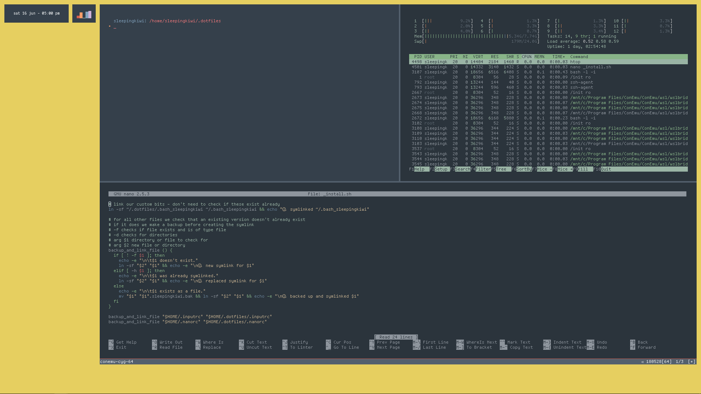

# ⚫files for my wsl setup

## installing linux dotfiles

- in WSL bash:
- `$ git clone https://github.com/sleepingkiwi/wsl-dotfiles.git ~/.dotfiles`
- `$ bash ~/.dotfiles/_install.sh`
- `$ cd ~/`
- `$ nano .bashrc`
- paste contents from `.bashrc` in this repo at the bottom of existing file.

## updating dotfiles

- `$ cd ~/.dotfiles`
- `$ git pull`
- `$ bash ~/.dotfiles/_install.sh`

---

## what is

### `.nanorc`

adding syntax highlighting to make quick edits easier

### `.bashrc and .bash_sleepingkiwi`

customising bash, adding aliases, defining colours etc.

all custom stuff is kept in .bash_sleepingkiwi and just imported into .bashrc because tons of other programs want to be editing .bashrc all the time and it gets noisy in there.

### `.inputrc`

customisations to _READLINE_, autocomplete settings mainly.

### `base16.yml`

scheme file for custom [base 16](http://chriskempson.com/projects/base16/) colour scheme.

### `ConEmu.xml`

settings, theme and colours for conemu terminal emulator

#### installing

- easiest option might be just copying file contents over to the settings file at `/mnt/c/Users/`__joe__`/AppData/Roaming/ConEmu.xml`
- symlinking might be risky because ConEmu expects to be able to write back to this file.

### `./rainmeter`

layout and skins for rainmeter

#### installing rainmeter skins

- install [rainmeter](https://www.rainmeter.net/)
- these will overwrite existing files:
- `$ cp -rf ~/.dotfiles/rainmeter/skins/sleepingkiwi/ "/mnt/c/Users/`__joe__`/Documents/Rainmeter/Skins/"`
- `$ cp -rf ~/.dotfiles/rainmeter/layout/sleepingkiwi/ "/mnt/c/Users/`__joe__`/AppData/Roaming/Rainmeter/Layouts/"`
- activate the layout from rainmeter settings

### `./sleepingkiwi-vscode`

colour theme and syntax highlighting for vs code using sleepingkiwi base16 colours

#### installing vs code theme

- install [vs code](https://code.visualstudio.com/)
- this will overwrite existing files:
- `$ cp -rf ~/.dotfiles/sleepingkiwi-vscode/ "/mnt/c/Users/`__joe__`/.vscode/extensions/"`
- activate the theme from vs code settings

### `./autohotkey`

autohotkey scripts for global macros or keyboard shortcuts

#### launching autohotkey script on startup

- launch _run_ dialog with `win + r`
- type: `%appdata%\Microsoft\Windows\Start Menu\Programs\Startup`
- create a shortcut of the script you want to run and put it in this location.

---

## 🎊

fonts and images used in this setup

### fonts

- [Tamsyn bitmap font (7x14)](http://www.fial.com/~scott/tamsyn-font/)
  - used in conemu
- [Dank Mono](https://dank.sh)
  - used in vs code
  - `"editor.fontFamily": "Dank Mono",`
  - `"editor.fontLigatures": true,`
- [Inconsolata](https://fonts.google.com/specimen/Inconsolata)
- [Hack](http://sourcefoundry.org/hack/)

### backgrounds

- older background in screen (hidden) by [Sara Alfa](https://www.sara-alfa.com/personal-illustrations)
- older background colour e6cf60

- current backgrounds used are slideshow of base16 highlight colours [stored on dropbox](https://www.dropbox.com/sh/p6eydu3809jxqsc/AAAdUTOfHijIF6mEG_yYBIP5a?dl=0)

👻
